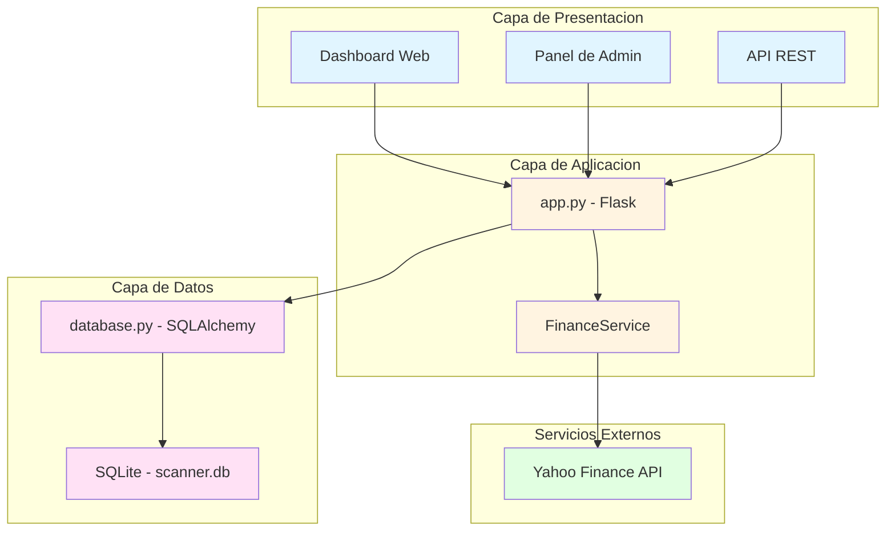

# Análisis Completo del Proyecto - Scanner Pro Python

**Fecha:** 28 de enero de 2026
**Estado:** Análisis completado
**Versión del proyecto:** Activa

## Resumen Ejecutivo

Scanner Pro Python es una aplicación web Flask para análisis de señales de trading en tiempo real. Permite monitorear tickers de acciones, sincronizar datos históricos desde Yahoo Finance y generar señales de trading basadas en diferentes estrategias técnicas (RSI+MACD y 3 EMAs).

El proyecto está bien estructurado, con una arquitectura modular que separa claramente las responsabilidades entre la aplicación web, el servicio financiero y la capa de base de datos.

## Arquitectura del Sistema

### Diagrama de Arquitectura



### Componentes Principales

#### 1. Aplicación Flask ([`app.py`](app.py))

**Responsabilidades:**
- Servidor web y API REST
- Gestión de rutas HTTP
- Integración con Swagger para documentación
- Caché de señales con `@lru_cache`

**Endpoints principales:**
| Endpoint | Método | Descripción |
|----------|--------|-------------|
| `/` | GET | Página principal (dashboard) |
| `/admin` | GET | Panel de administración |
| `/api/tickers` | GET/POST | Obtener/agregar tickers |
| `/api/tickers/<id>` | DELETE | Eliminar ticker |
| `/api/seed` | POST | Agregar tickers iniciales |
| `/api/refresh` | POST | Sincronizar datos |
| `/api/scan` | GET | Escanear y obtener señales |

**Características destacadas:**
- Configuración flexible con variables de entorno
- Soporte para DATABASE_URL (Render) y SQLite local
- Flasgger opcional (no falla si no está instalado)
- Caché LRU para optimizar peticiones repetidas

#### 2. Servicio Financiero ([`finance_service.py`](finance_service.py))

**Responsabilidades:**
- Sincronización de datos desde Yahoo Finance
- Cálculo de indicadores técnicos (RSI, MACD, EMAs)
- Normalización de símbolos de tickers
- Generación de señales de trading

**Métodos principales:**
- `normalize_symbol()`: Convierte símbolos para yfinance
- `sync_ticker_data()`: Sincroniza datos con reintentos
- `get_signals()`: Calcula señales según estrategia

**Características destacadas:**
- Sistema de reintentos robusto (3 intentos, 2s delay)
- Selección automática de período según antigüedad
- Optimización con `itertuples()` y `set()` para duplicados
- Bulk insert con `bulk_save_objects()`
- Logging detallado para diagnóstico

#### 3. Base de Datos ([`database.py`](database.py))

**Modelos:**

**Tabla `ticker`:**
| Columna | Tipo | Descripción |
|---------|------|-------------|
| id | Integer | Identificador único (PK) |
| symbol | String(20) | Símbolo del ticker (único) |
| name | String(100) | Nombre del ticker |
| sector | String(100) | Sector del ticker |
| is_active | Boolean | Estado del ticker |
| last_sync | DateTime | Última sincronización |

**Tabla `price`:**
| Columna | Tipo | Descripción |
|---------|------|-------------|
| id | Integer | Identificador único (PK) |
| ticker_id | Integer | ID del ticker (FK) |
| date | Date | Fecha del precio |
| open | Float | Precio de apertura |
| high | Float | Precio máximo |
| low | Float | Precio mínimo |
| close | Float | Precio de cierre |
| volume | BigInteger | Volumen de operaciones |

**Restricciones:**
- Unique constraint: `(ticker_id, date)`
- Índice compuesto: `idx_ticker_date` en `(ticker_id, date)`

### Scripts de Utilidad

| Script | Propósito |
|--------|-----------|
| [`scripts/add_ticker.py`](scripts/add_ticker.py) | Agregar un ticker |
| [`scripts/delete_ticker.py`](scripts/delete_ticker.py) | Eliminar un ticker |
| [`scripts/check_db.py`](scripts/check_db.py) | Verificar estado de la base de datos |
| [`scripts/check_ticker_status.py`](scripts/check_ticker_status.py) | Verificar estado de un ticker |
| [`scripts/check_multiple_tickers.py`](scripts/check_multiple_tickers.py) | Verificar múltiples tickers |
| [`scripts/delete_empty_tickers.py`](scripts/delete_empty_tickers.py) | Eliminar tickers sin datos |
| [`scripts/delete_multiple_tickers.py`](scripts/delete_multiple_tickers.py) | Eliminar múltiples tickers |
| [`scripts/sync_data.py`](scripts/sync_data.py) | Sincronización manual de datos |
| [`scripts/test_optimizations.py`](scripts/test_optimizations.py) | Pruebas de optimización |

## Estrategias de Trading Implementadas

### Estrategia 1: RSI + MACD

**Indicadores:**
- RSI (Relative Strength Index) con período 14
- SMA del RSI con período 14
- MACD (12, 26, 9)

**Señales generadas:**
- **RSI Oversold**: RSI < 30
- **RSI Bullish**: RSI cruza por encima de su SMA después de oversold
- **MACD Active**: MACD > Signal y MACD ≤ 0

### Estrategia 2: 3 EMAs

**Indicadores:**
- EMA 4 (diaria)
- EMA 9 (diaria)
- EMA 18 (diaria)
- EMA 4 (semanal)
- EMA 9 (semanal)
- EMA 18 (semanal)

**Señales generadas:**
- **Diaria**: Precio > EMA4 > EMA9 > EMA18
- **Semanal**: Precio > EMA4 > EMA9 > EMA18 (resampleado a viernes)

## Estado Actual de Optimizaciones

### Optimizaciones Implementadas

Según los documentos [`plans/optimizacion_rendimiento.md`](plans/optimizacion_rendimiento.md) y [`plans/analisis_cambios.md`](plans/analisis_cambios.md), se han implementado las siguientes optimizaciones:

#### Fase 1: Cambios Inmediatos ✅
1. ✅ Reemplazar `iterrows()` con `itertuples()` - 50-70% más rápido
2. ✅ Reducir delay entre tickers de 1s a 0.3s - 50% menos tiempo
3. ✅ Agregar índice compuesto a Price - 30-50% más rápido en consultas

#### Fase 2: Cambios de Alto Impacto ✅
4. ✅ Usar `set()` para verificar duplicados - 90% más rápido
5. ✅ Usar `bulk_save_objects()` para inserciones - 80-90% más rápido
6. ✅ Usar `with_entities()` para cargar solo campos necesarios - 20-30% más rápido

#### Fase 3: Optimización Adicional ✅
7. ✅ Implementar caché simple con `@lru_cache` - 95% más rápido en peticiones repetidas

### Mejoras de Rendimiento Esperadas

| Métrica | Estado Original | Después de Optimizaciones |
|---------|------------------|---------------------------|
| Sincronización 1 ticker | ~2-3s | ~0.2-0.3s |
| Sincronización 100 tickers | ~200-300s | ~30-50s |
| Endpoint /api/scan (1ra vez) | ~5-10s | ~1-2s |
| Endpoint /api/scan (caché) | ~5-10s | ~0.1-0.2s |
| Inserción 500 precios | ~5-8s | ~0.5-1s |

**Mejora total esperada:** 80-95% más rápido en la mayoría de operaciones.

## Dependencias del Proyecto

### Dependencias Principales ([`requirements.txt`](requirements.txt))

| Paquete | Versión | Propósito |
|---------|---------|-----------|
| Flask | 3.0.0 | Framework web |
| Flask-SQLAlchemy | 3.1.1 | ORM para base de datos |
| yfinance | >=0.2.52 | Datos financieros de Yahoo |
| pandas | >=2.2.2 | Manipulación de datos |
| pandas-ta | 0.4.71b0 | Análisis técnico |
| flasgger | 0.9.7.1 | Documentación Swagger |
| gunicorn | 21.2.0 | Servidor WSGI para producción |
| requests | 2.31.0 | Cliente HTTP |
| SQLAlchemy | >=2.0.36 | ORM base |

## Configuración y Despliegue

### Variables de Entorno

| Variable | Descripción | Valor por Defecto |
|----------|-------------|-------------------|
| `DATABASE_URL` | URI de conexión a la base de datos | `sqlite:///instance/scanner.db` |
| `HOST` | Host del servidor Flask | `0.0.0.0` |
| `PORT` | Puerto del servidor Flask | `5000` |
| `FLASK_DEBUG` | Modo de depuración | `0` |

### Opciones de Despliegue

#### 1. Render
- Conectar repositorio a Render
- Configurar variables de entorno
- Despliegue automático

#### 2. Docker
```dockerfile
FROM python:3.11-slim
WORKDIR /app
COPY requirements.txt .
RUN pip install --no-cache-dir -r requirements.txt
COPY . .
CMD ["python", "app.py"]
```

## Convenciones y Reglas del Proyecto

### Normalización de Símbolos (CRÍTICO)
- Siempre usar `FinanceService.normalize_symbol()` antes de consultar yfinance
- `BCBA:TICKER` → `TICKER.BA`
- `BRK.B` → `BRK-K`

### Uso de yfinance API
- Usar parámetro `period` en lugar de `start`/`end`
- Selección automática según días desde última sincronización:
  - ≤ 30 días: `"1mo"`
  - ≤ 90 días: `"3mo"`
  - ≤ 180 días: `"6mo"`
  - > 180 días: `"2y"`
- Siempre configurar `progress=False` y `timeout=30`

### Operaciones de Base de Datos
- Scripts que acceden a la base de datos DEBEN usar `with app.app_context():`
- El modelo Price tiene restricción única en `(ticker_id, date)`
- `get_signals()` retorna `None` si el ticker tiene < 30 registros de precios

### Manejo de Pandas MultiIndex
```python
if isinstance(data.columns, pd.MultiIndex):
    data.columns = data.columns.get_level_values(0)
```

### Resampling Semanal
- Usar frecuencia `'W-FRI'` para datos semanales
- Limitar fechas a hoy para evitar etiquetas futuras:
```python
w_start_capped = min(w_start_dt, today)
```

### Manejo de Errores
- Flasgger es OPCIONAL: usar try/except en import
- Operaciones de sincronización usan 3 reintentos con delays de 2 segundos
- Agregar delay de 0.3 segundos entre tickers en refresh loop

### Flujo de Trabajo Git
- Nomenclatura de ramas: `YYYY-MM-DD-N` (ej: `26-01-26-1`)
- Publicar ramas inmediatamente: `git push -u origin branch-name`
- Mensajes de commit en español, tiempo presente, ≤72 caracteres
- Push después de cada commit relevante

### Ubicación de Base de Datos
- SQLite DB: `instance/scanner.db` (ruta relativa, convertida a absoluta)
- Directorio creado automáticamente en `init_db()` si no existe

### Logging
- Usar módulo `logging` (configurado en nivel INFO)
- Formato: `logger.info(f"  {symbol}: {count} nuevos registros agregados")`

## Fortalezas del Proyecto

1. **Arquitectura Modular**: Separación clara de responsabilidades entre componentes
2. **Optimizaciones Implementadas**: Mejoras de rendimiento significativas ya aplicadas
3. **Documentación Completa**: README, DOCUMENTACION.md, AGENTS.md y planes detallados
4. **Sistema de Reintentos Robusto**: Manejo de errores en sincronización
5. **Caché Eficiente**: Implementación de LRU cache para optimizar respuestas
6. **Normalización de Símbolos**: Manejo correcto de diferentes formatos de tickers
7. **Sincronización Incremental**: Evita descargas redundantes
8. **Múltiples Estrategias**: Soporte para diferentes enfoques de trading
9. **API REST**: Endpoints bien definidos para integración
10. **Scripts de Utilidad**: Herramientas para mantenimiento y diagnóstico

## Áreas de Mejora Potenciales

### 1. Testing
- No hay evidencia de tests automatizados
- Se recomienda agregar pruebas unitarias y de integración

### 2. Monitoreo y Métricas
- No hay sistema de monitoreo en producción
- Se recomienda agregar métricas de rendimiento y alertas

### 3. Manejo de Concurrencia
- El caché LRU puede tener problemas en entornos multi-usuario
- Se recomienda evaluar Flask-Caching para mejor control

### 4. Validación de Datos
- No hay validación exhaustiva de datos de entrada
- Se recomienda agregar validaciones más robustas

### 5. Documentación de API
- Swagger está implementado pero es opcional
- Se recomienda asegurar que esté siempre disponible

### 6. Gestión de Errores
- Manejo de errores básico pero podría ser más detallado
- Se recomienda agregar logging estructurado y tracing

### 7. Configuración
- Configuración en variables de entorno pero podría usar un archivo de configuración
- Se recomienda considerar `config.py` para ambientes múltiples

### 8. Seguridad
- No hay evidencia de implementación de seguridad (CORS, rate limiting, autenticación)
- Se recomienda agregar medidas de seguridad si se expone públicamente

## Estado de Documentación

| Documento | Estado | Contenido |
|-----------|--------|-----------|
| [`readme.md`](readme.md) | ✅ Completo | Guía de instalación, uso y API |
| [`DOCUMENTACION.md`](DOCUMENTACION.md) | ✅ Completo | Documentación técnica detallada |
| [`AGENTS.md`](AGENTS.md) | ✅ Completo | Reglas y convenciones para agentes |
| [`MEJORAS_SINCRONIZACION.md`](MEJORAS_SINCRONIZACION.md) | ✅ Completo | Registro de mejoras en sincronización |
| [`plans/optimizacion_rendimiento.md`](plans/optimizacion_rendimiento.md) | ✅ Completo | Plan de optimización de rendimiento |
| [`plans/analisis_cambios.md`](plans/analisis_cambios.md) | ✅ Completo | Análisis detallado de cambios |

## Conclusión

Scanner Pro Python es un proyecto bien estructurado y maduro con una arquitectura sólida. Las optimizaciones de rendimiento implementadas han mejorado significativamente la velocidad de las operaciones. El proyecto cuenta con documentación completa y sigue buenas prácticas de desarrollo.

Las áreas principales de mejora se centran en testing, monitoreo, seguridad y manejo de concurrencia, pero estas son mejoras que pueden implementarse de manera incremental según las necesidades del proyecto.

---

**Analizado por:** Roo (Architect Mode)
**Fecha de análisis:** 28 de enero de 2026
