# Diagramas de Arquitectura - Mejoras Propuestas

**Fecha:** 29 de enero de 2026
**Relacionado con:** [`mejoras_propuestas.md`](mejoras_propuestas.md)

## Arquitectura Actual vs Propuesta

### Arquitectura Actual

### Arquitectura Propuesta con Mejoras

---

## Diagrama de Capas con Mejoras

---

## Flujo de Datos con Mejoras

### Flujo de Sincronización Mejorado

```mermaid
sequenceDiagram
    participant C as Cliente
    participant RL as Rate Limiter
    participant Auth as JWT Auth
    participant API as API Route
    participant FS as FinanceService
    participant Cache as Redis Cache
    participant YF as yfinance API
    participant DB as Database
    participant Events as Events System
    participant Notif as Notification Service
    participant Metrics as Prometheus
    
    C->>RL: POST /api/refresh
    RL->>Auth: Verificar rate limit
    Auth->>API: Validar token JWT
    API->>FS: sync_all_tickers()
    
    loop Para cada ticker
        FS->>Cache: Verificar caché
        alt Caché hit
            Cache-->>FS: Datos en caché
        else Caché miss
            FS->>YF: Descargar datos
            YF-->>FS: Datos históricos
            FS->>DB: Guardar precios
            DB-->>FS: Confirmación
            FS->>Cache: Guardar en caché
        end
        FS->>Events: Emitir evento ticker_synced
        Events->>Metrics: Registrar métricas
        Events->>Notif: Verificar alertas
        alt Alerta activada
            Notif->>C: Enviar email notificación
        end
    end
    
    FS-->>API: Resultados
    API->>Metrics: Registrar duración
    API-->>C: JSON con resultados
```

### Flujo de Consulta de Señales con Caché

```mermaid
sequenceDiagram
    participant C as Cliente
    participant WS as WebSocket
    participant API as API Route
    participant Cache as LRU Cache
    participant FS as FinanceService
    participant DB as Database
    participant Metrics as Prometheus
    
    C->>WS: Conectar WebSocket
    WS-->>C: Conexión establecida
    
    C->>API: GET /api/scan?strategy=rsi_macd
    API->>Cache: Verificar caché (ticker_id, strategy)
    
    alt Caché hit
        Cache-->>API: Señales en caché
        API->>Metrics: Registrar cache hit
    else Caché miss
        API->>FS: get_signals(ticker, strategy)
        FS->>DB: Consultar precios
        DB-->>FS: Datos de precios
        FS->>FS: Calcular indicadores
        FS-->>API: Señales calculadas
        API->>Cache: Guardar en caché
        API->>Metrics: Registrar cache miss
    end
    
    API-->>C: JSON con señales
    
    Note over WS,C: Actualización en tiempo real
    Events->>WS: Emitir señal actualizada
    WS-->>C: Actualizar dashboard
```

---

## Diagrama de Despliegue con Mejoras

---

## Diagrama de Testing con Mejoras

---

## Diagrama de Seguridad con Mejoras

---

## Diagrama de Configuración por Ambiente

---

## Diagrama de Flujo de Eventos

```mermaid
graph LR
    subgraph Eventos
        E1[ticker_added]
        E2[ticker_synced]
        E3[ticker_deleted]
        E4[sync_error]
        E5[signal_alert]
    end
    
    subgraph Suscriptores
        S1[Email Notifier]
        S2[WebSocket Broadcaster]
        S3[Metrics Collector]
        S4[Audit Logger]
        S5[Alert Manager]
    end
    
    subgraph Acciones
        A1[Enviar Email]
        A2[Broadcast WebSocket]
        A3[Registrar Métrica]
        A4[Log Auditoría]
        A5[Disparar Alerta]
    end
    
    E1 --> S1
    E1 --> S3
    E1 --> S4
    E2 --> S2
    E2 --> S3
    E3 --> S3
    E3 --> S4
    E4 --> S1
    E4 --> S3
    E4 --> S5
    E5 --> S1
    E5 --> S2
    E5 --> S5
    
    S1 --> A1
    S2 --> A2
    S3 --> A3
    S4 --> A4
    S5 --> A5
    
    style E1 fill:#e1f5ff
    style E2 fill:#e1f5ff
    style E3 fill:#e1f5ff
    style E4 fill:#e1f5ff
    style E5 fill:#e1f5ff
    style S1 fill:#fff4e1
    style S2 fill:#fff4e1
    style S3 fill:#fff4e1
    style S4 fill:#fff4e1
    style S5 fill:#fff4e1
    style A1 fill:#ccffcc
    style A2 fill:#ccffcc
    style A3 fill:#ccffcc
    style A4 fill:#ccffcc
    style A5 fill:#ccffcc
```

---

## Resumen de Componentes Nuevos

| Componente | Categoría | Prioridad | Complejidad |
|-------------|-----------|-----------|-------------|
| Rate Limiter | Seguridad | 🔴 Alta | Baja |
| CORS Middleware | Seguridad | 🔴 Alta | Baja |
| JWT Authentication | Seguridad | 🟡 Media | Media |
| Input Validation | Seguridad | 🔴 Alta | Media |
| Redis Cache | Datos | 🟡 Media | Media |
| Events System | Arquitectura | 🟢 Baja | Media |
| Notification Service | Funcionalidad | 🟡 Media | Media |
| Health Checks | Monitoreo | 🔴 Alta | Baja |
| Prometheus Metrics | Monitoreo | 🟡 Media | Media |
| Structured Logging | Monitoreo | 🔴 Alta | Media |
| Alembic Migrations | Base de Datos | 🔴 Alta | Media |
| Backup System | Base de Datos | 🟡 Media | Media |
| Unit Tests | Testing | 🔴 Alta | Media |
| Integration Tests | Testing | 🟡 Media | Media |
| Docker Multi-Stage | DevOps | 🔴 Alta | Media |
| GitHub Actions CI/CD | DevOps | 🟡 Media | Media |
| WebSocket | Funcionalidad | 🟢 Baja | Media |
| Email Service | Funcionalidad | 🟡 Media | Media |

---

**Documento creado por:** Roo (Architect Mode)
**Fecha de creación:** 29 de enero de 2026
**Relacionado con:** [`mejoras_propuestas.md`](mejoras_propuestas.md)
