# Plan de Mejoras Propuestas - Scanner Pro Python

**Fecha:** 29 de enero de 2026
**Estado:** Propuesta
**Versión del proyecto:** Activa

## Resumen Ejecutivo

Este documento presenta un plan integral de mejoras para el proyecto Scanner Pro Python, organizadas por categorías y priorizadas por impacto y complejidad. Las optimizaciones de rendimiento ya implementadas (Fases 1-3) han mejorado significativamente la velocidad del sistema. Este plan se enfoca en áreas adicionales para mejorar la calidad, seguridad, mantenibilidad y funcionalidad del proyecto.

## Estado Actual del Proyecto

### Fortalezas Identificadas

1. **Arquitectura Modular**: Separación clara de responsabilidades entre componentes
2. **Optimizaciones de Rendimiento**: Mejoras de 80-95% ya implementadas
3. **Documentación Completa**: README, DOCUMENTACION.md, AGENTS.md y planes detallados
4. **Sistema de Reintentos Robusto**: Manejo de errores en sincronización
5. **Caché Eficiente**: Implementación de LRU cache para optimizar respuestas
6. **Normalización de Símbolos**: Manejo correcto de diferentes formatos
7. **Sincronización Incremental**: Evita descargas redundantes
8. **Múltiples Estrategias**: Soporte para RSI+MACD y 3 EMAs
9. **API REST**: Endpoints bien definidos para integración
10. **Scripts de Utilidad**: Herramientas para mantenimiento y diagnóstico

### Optimizaciones Ya Implementadas ✅

| Optimización | Estado | Mejora |
|--------------|--------|--------|
| iterrows() → itertuples() | ✅ | 50-70% más rápido |
| Delay reducido a 0.3s | ✅ | 50% menos tiempo |
| Índice compuesto en Price | ✅ | 30-50% más rápido |
| set() para duplicados | ✅ | 90% más rápido |
| bulk_save_objects() | ✅ | 80-90% más rápido |
| with_entities() | ✅ | 20-30% más rápido |
| LRU cache | ✅ | 95% más rápido (caché) |

---

## Categorías de Mejoras Propuestas

### 1. Testing Automatizado

#### 1.1 Tests Unitarios con pytest

**Prioridad:** 🔴 Alta
**Impacto:** Alto
**Complejidad:** Media

**Descripción:** Implementar suite de tests unitarios para cubrir la lógica de negocio.

**Archivos a crear:**
- `tests/__init__.py`
- `tests/test_finance_service.py`
- `tests/test_database.py`
- `tests/test_api.py`
- `tests/conftest.py`

**Cobertura esperada:** >80%

**Ejemplo de implementación:**
```python
# tests/test_finance_service.py
import pytest
from finance_service import FinanceService
from database import Ticker

def test_normalize_symbol():
    assert FinanceService.normalize_symbol('BCBA:TICKER') == 'TICKER.BA'
    assert FinanceService.normalize_symbol('BRK.B') == 'BRK-K'
    assert FinanceService.normalize_symbol('AAPL') == 'AAPL'

def test_get_signals_rsi_macd(db_session):
    ticker = Ticker(symbol='AAPL')
    db_session.add(ticker)
    db_session.commit()
    
    signals = FinanceService.get_signals(ticker, strategy='rsi_macd')
    assert signals is not None
    assert 'rsi' in signals
    assert 'macd_status' in signals
```

**Dependencias:**
```txt
pytest>=7.4.0
pytest-cov>=4.1.0
pytest-mock>=3.11.0
pytest-flask>=1.2.0
```

**Beneficios:**
- Detectar regresiones en el código
- Facilitar refactoring seguro
- Documentación viva del comportamiento esperado
- Mayor confianza en cambios

---

#### 1.2 Tests de Integración

**Prioridad:** 🟡 Media
**Impacto:** Alto
**Complejidad:** Media

**Descripción:** Tests que verifican la integración entre componentes.

**Archivos a crear:**
- `tests/integration/test_sync_workflow.py`
- `tests/integration/test_api_endpoints.py`

**Ejemplo:**
```python
# tests/integration/test_sync_workflow.py
def test_full_sync_workflow(client, db_session):
    # Agregar ticker
    response = client.post('/api/tickers', json={'symbol': 'AAPL'})
    assert response.status_code == 200
    
    # Sincronizar
    response = client.post('/api/refresh')
    assert response.status_code == 200
    
    # Verificar señales
    response = client.get('/api/scan?strategy=rsi_macd')
    assert response.status_code == 200
    data = response.json()
    assert len(data) > 0
```

---

#### 1.3 Mocking de yfinance

**Prioridad:** 🟡 Media
**Impacto:** Medio
**Complejidad:** Baja

**Descripción:** Crear mocks para evitar llamadas a la API de Yahoo Finance en tests.

**Implementación:**
```python
# tests/conftest.py
import pytest
from unittest.mock import patch, MagicMock
import pandas as pd

@pytest.fixture
def mock_yfinance_download():
    def _mock_download(symbol, period=None, progress=False, timeout=30):
        # Retornar datos de prueba
        dates = pd.date_range('2024-01-01', periods=100, freq='D')
        return pd.DataFrame({
            'Open': [100.0] * 100,
            'High': [105.0] * 100,
            'Low': [95.0] * 100,
            'Close': [102.0] * 100,
            'Volume': [1000000] * 100
        }, index=dates)
    
    return patch('yfinance.download', side_effect=_mock_download)
```

---

#### 1.4 Tests de Rendimiento

**Prioridad:** 🟢 Baja
**Impacto:** Medio
**Complejidad:** Media

**Descripción:** Tests para validar que las optimizaciones de rendimiento se mantienen.

**Implementación:**
```python
# tests/test_performance.py
import time
import pytest

def test_sync_performance_threshold(mock_yfinance_download, client, db_session):
    """Verificar que la sincronización no exceda cierto tiempo."""
    start = time.time()
    response = client.post('/api/refresh')
    elapsed = time.time() - start
    
    assert response.status_code == 200
    assert elapsed < 10.0  # Máximo 10 segundos para 5 tickers de prueba
```

---

### 2. Seguridad y Autenticación

#### 2.1 Rate Limiting

**Prioridad:** 🔴 Alta
**Impacto:** Alto
**Complejidad:** Baja

**Descripción:** Implementar límites de tasa para prevenir abuso de la API.

**Dependencias:**
```txt
Flask-Limiter>=3.5.0
```

**Implementación:**
```python
# app.py
from flask_limiter import Limiter
from flask_limiter.util import get_remote_address

limiter = Limiter(
    app=app,
    key_func=get_remote_address,
    default_limits=["200 per day", "50 per hour"]
)

@app.route('/api/refresh', methods=['POST'])
@limiter.limit("5 per hour")
def refresh_data():
    # ... código existente ...
```

**Beneficios:**
- Prevenir abuso de la API
- Proteger contra ataques DDoS
- Controlar uso de recursos

---

#### 2.2 Configuración de CORS

**Prioridad:** 🔴 Alta
**Impacto:** Medio
**Complejidad:** Baja

**Descripción:** Configurar CORS correctamente para permitir acceso controlado.

**Dependencias:**
```txt
Flask-CORS>=4.0.0
```

**Implementación:**
```python
# app.py
from flask_cors import CORS

# Configuración básica
CORS(app, resources={
    r"/api/*": {
        "origins": ["http://localhost:3000", "https://tudominio.com"],
        "methods": ["GET", "POST", "DELETE"],
        "allow_headers": ["Content-Type"]
    }
})
```

**Beneficios:**
- Controlar qué dominios pueden acceder
- Prevenir ataques CSRF
- Mejorar seguridad

---

#### 2.3 Validación de Entrada Robusta

**Prioridad:** 🔴 Alta
**Impacto:** Alto
**Complejidad:** Media

**Descripción:** Implementar validación exhaustiva de datos de entrada.

**Dependencias:**
```txt
marshmallow>=3.20.0
```

**Implementación:**
```python
# schemas.py
from marshmallow import Schema, fields, validate, ValidationError

class TickerSchema(Schema):
    symbol = fields.Str(
        required=True,
        validate=validate.Length(min=1, max=20),
        validate=validate.Regexp(r'^[A-Z]{1,5}(\.[A-Z]{1,2})?$')
    )

class TickerQuerySchema(Schema):
    strategy = fields.Str(
        validate=validate.OneOf(['rsi_macd', '3_emas']),
        missing='rsi_macd'
    )

# app.py
from schemas import TickerSchema, TickerQuerySchema

@app.route('/api/tickers', methods=['POST'])
def handle_tickers():
    try:
        data = TickerSchema().load(request.json)
    except ValidationError as err:
        return jsonify({'error': err.messages}), 400
    # ... resto del código ...
```

**Beneficios:**
- Prevenir inyección de datos maliciosos
- Mejor manejo de errores
- Documentación automática de validaciones

---

#### 2.4 Autenticación JWT

**Prioridad:** 🟡 Media
**Impacto:** Alto
**Complejidad:** Media

**Descripción:** Implementar autenticación basada en JWT para proteger endpoints sensibles.

**Dependencias:**
```txt
Flask-JWT-Extended>=4.5.0
```

**Implementación:**
```python
# config.py
class Config:
    JWT_SECRET_KEY = os.environ.get('JWT_SECRET_KEY', 'dev-secret-key-change-in-production')
    JWT_ACCESS_TOKEN_EXPIRES = timedelta(hours=1)

# app.py
from flask_jwt_extended import (
    JWTManager, jwt_required, create_access_token,
    get_jwt_identity
)

jwt = JWTManager(app)

@app.route('/api/login', methods=['POST'])
def login():
    username = request.json.get('username')
    password = request.json.get('password')
    
    # Verificar credenciales (implementar lógica real)
    if username == 'admin' and password == 'secure_password':
        access_token = create_access_token(identity=username)
        return jsonify({'access_token': access_token})
    
    return jsonify({'error': 'Invalid credentials'}), 401

@app.route('/api/refresh', methods=['POST'])
@jwt_required()
def refresh_data():
    # Solo usuarios autenticados pueden sincronizar
    # ... código existente ...
```

**Beneficios:**
- Proteger endpoints sensibles
- Controlar acceso a funcionalidades
- Auditoría de acciones

---

#### 2.5 Sanitización de Datos

**Prioridad:** 🟡 Media
**Impacto:** Medio
**Complejidad:** Baja

**Descripción:** Sanitizar datos de entrada para prevenir XSS y SQL injection.

**Implementación:**
```python
# utils.py
import re

def sanitize_symbol(symbol):
    """Sanitizar símbolo de ticker."""
    if not symbol:
        return None
    # Remover caracteres peligrosos
    symbol = re.sub(r'[^A-Za-z0-9\.\-:]', '', symbol)
    return symbol.upper().strip()

def sanitize_string(text, max_length=100):
    """Sanitizar texto genérico."""
    if not text:
        return None
    text = re.sub(r'[<>"\']', '', text)
    return text[:max_length].strip()
```

---

### 3. Monitoreo y Observabilidad

#### 3.1 Logging Estructurado

**Prioridad:** 🔴 Alta
**Impacto:** Alto
**Complejidad:** Media

**Descripción:** Implementar logging estructurado con JSON para mejor análisis.

**Dependencias:**
```txt
python-json-logger>=2.0.0
```

**Implementación:**
```python
# logging_config.py
from pythonjsonlogger import jsonlogger
import logging
import sys

def setup_logging(app):
    handler = logging.StreamHandler(sys.stdout)
    formatter = jsonlogger.JsonFormatter(
        '%(asctime)s %(name)s %(levelname)s %(message)s'
    )
    handler.setFormatter(formatter)
    
    app.logger.addHandler(handler)
    app.logger.setLevel(logging.INFO)
    
    # También configurar logger de finance_service
    logging.getLogger('finance_service').setLevel(logging.INFO)

# app.py
from logging_config import setup_logging

setup_logging(app)
```

**Beneficios:**
- Logs más fáciles de analizar
- Integración con herramientas de log aggregation
- Mejor debugging en producción

---

#### 3.2 Métricas con Prometheus

**Prioridad:** 🟡 Media
**Impacto:** Alto
**Complejidad:** Media

**Descripción:** Implementar métricas de rendimiento y uso.

**Dependencias:**
```txt
prometheus-client>=0.19.0
```

**Implementación:**
```python
# metrics.py
from prometheus_client import Counter, Histogram, Gauge, generate_latest
from flask import Response

# Métricas
request_count = Counter('http_requests_total', 'Total HTTP requests', ['method', 'endpoint', 'status'])
request_duration = Histogram('http_request_duration_seconds', 'HTTP request duration')
sync_duration = Histogram('sync_duration_seconds', 'Ticker sync duration', ['symbol'])
active_tickers = Gauge('active_tickers_count', 'Number of active tickers')
sync_errors = Counter('sync_errors_total', 'Total sync errors', ['symbol', 'error_type'])

# app.py
from metrics import request_count, request_duration

@app.before_request
def before_request():
    g.start_time = time.time()

@app.after_request
def after_request(response):
    if hasattr(g, 'start_time'):
        duration = time.time() - g.start_time
        request_duration.observe(duration)
        request_count.labels(
            method=request.method,
            endpoint=request.path,
            status=response.status_code
        ).inc()
    return response

@app.route('/metrics')
def metrics():
    return Response(generate_latest(), mimetype='text/plain')
```

**Beneficios:**
- Monitoreo en tiempo real
- Alertas basadas en métricas
- Análisis de tendencias

---

#### 3.3 Health Checks

**Prioridad:** 🔴 Alta
**Impacto:** Alto
**Complejidad:** Baja

**Descripción:** Implementar endpoint de health check para monitoreo.

**Implementación:**
```python
# app.py
@app.route('/health')
def health_check():
    """Health check endpoint para Kubernetes/load balancers."""
    checks = {
        'status': 'healthy',
        'timestamp': datetime.now().isoformat(),
        'checks': {}
    }
    
    # Verificar base de datos
    try:
        db.session.execute(db.text('SELECT 1'))
        checks['checks']['database'] = 'ok'
    except Exception as e:
        checks['checks']['database'] = f'error: {str(e)}'
        checks['status'] = 'unhealthy'
        return jsonify(checks), 503
    
    # Verificar conexión a yfinance (opcional)
    checks['checks']['yfinance'] = 'not_checked'
    
    status_code = 200 if checks['status'] == 'healthy' else 503
    return jsonify(checks), status_code
```

**Beneficios:**
- Integración con orquestadores (Kubernetes)
- Detección temprana de problemas
- Mejor uptime

---

#### 3.4 Tracing Distribuido

**Prioridad:** 🟢 Baja
**Impacto:** Medio
**Complejidad:** Alta

**Descripción:** Implementar tracing para seguir peticiones a través del sistema.

**Dependencias:**
```txt
opentelemetry-api>=1.21.0
opentelemetry-sdk>=1.21.0
opentelemetry-instrumentation-flask>=0.42b0
```

**Implementación:**
```python
# tracing.py
from opentelemetry import trace
from opentelemetry.sdk.trace import TracerProvider
from opentelemetry.sdk.trace.export import BatchSpanProcessor
from opentelemetry.exporter.jaeger import JaegerExporter

def setup_tracing():
    trace.set_tracer_provider(TracerProvider())
    tracer = trace.get_tracer(__name__)
    
    jaeger_exporter = JaegerExporter(
        agent_host_name="localhost",
        agent_port=6831,
    )
    
    span_processor = BatchSpanProcessor(jaeger_exporter)
    trace.get_tracer_provider().add_span_processor(span_processor)
    
    return tracer
```

**Beneficios:**
- Seguimiento de peticiones distribuidas
- Identificación de cuellos de botella
- Mejor debugging

---

### 4. Base de Datos y Migraciones

#### 4.1 Migraciones con Alembic

**Prioridad:** 🔴 Alta
**Impacto:** Alto
**Complejidad:** Media

**Descripción:** Implementar sistema de migraciones para cambios en el esquema.

**Dependencias:**
```txt
Flask-Migrate>=4.0.5
```

**Implementación:**
```bash
# Inicializar migraciones
flask db init

# Crear migración
flask db migrate -m "Add user table"

# Aplicar migración
flask db upgrade

# Revertir migración
flask db downgrade
```

**Configuración:**
```python
# app.py
from flask_migrate import Migrate

migrate = Migrate(app, db)
```

**Beneficios:**
- Control de versiones del esquema
- Rollback de cambios
- Despliegue controlado

---

#### 4.2 Backups Automáticos

**Prioridad:** 🟡 Media
**Impacto:** Alto
**Complejidad:** Media

**Descripción:** Implementar sistema de backups automáticos de la base de datos.

**Implementación:**
```python
# scripts/backup_db.py
import shutil
from datetime import datetime
import os

def backup_database():
    """Crear backup de la base de datos."""
    db_path = 'instance/scanner.db'
    backup_dir = 'backups'
    
    if not os.path.exists(backup_dir):
        os.makedirs(backup_dir)
    
    timestamp = datetime.now().strftime('%Y%m%d_%H%M%S')
    backup_path = os.path.join(backup_dir, f'scanner_{timestamp}.db')
    
    shutil.copy2(db_path, backup_path)
    print(f"Backup creado: {backup_path}")
    
    # Mantener solo los últimos 7 backups
    backups = sorted(os.listdir(backup_dir))
    for old_backup in backups[:-7]:
        os.remove(os.path.join(backup_dir, old_backup))
        print(f"Backup antiguo eliminado: {old_backup}")

if __name__ == '__main__':
    backup_database()
```

**Cron job:**
```cron
# Backup diario a las 2 AM
0 2 * * * cd /path/to/scanner-py && python scripts/backup_db.py
```

**Beneficios:**
- Protección contra pérdida de datos
- Recuperación de desastres
- Auditoría histórica

---

#### 4.3 Connection Pooling

**Prioridad:** 🟢 Baja
**Impacto:** Medio
**Complejidad:** Baja

**Descripción:** Configurar connection pooling para mejor rendimiento.

**Implementación:**
```python
# app.py
app.config['SQLALCHEMY_ENGINE_OPTIONS'] = {
    'pool_size': 10,
    'max_overflow': 20,
    'pool_timeout': 30,
    'pool_recycle': 3600,
    'pool_pre_ping': True
}
```

**Beneficios:**
- Mejor rendimiento bajo carga
- Reutilización de conexiones
- Manejo de conexiones muertas

---

#### 4.4 Migración a PostgreSQL (Opcional)

**Prioridad:** 🟢 Baja
**Impacto:** Medio
**Complejidad:** Alta

**Descripción:** Evaluar migración a PostgreSQL para producción.

**Consideraciones:**
- SQLite es adecuado para desarrollo y uso personal
- PostgreSQL ofrece mejor concurrencia y escalabilidad
- Requiere infraestructura adicional

**Configuración:**
```python
# config.py
class ProductionConfig:
    SQLALCHEMY_DATABASE_URI = os.environ.get('DATABASE_URL')
    SQLALCHEMY_ENGINE_OPTIONS = {
        'pool_size': 20,
        'max_overflow': 40,
        'pool_pre_ping': True
    }
```

**Beneficios:**
- Mejor concurrencia
- Escalabilidad horizontal
- Funciones avanzadas de base de datos

---

### 5. API Mejorada

#### 5.1 Paginación

**Prioridad:** 🔴 Alta
**Impacto:** Alto
**Complejidad:** Baja

**Descripción:** Implementar paginación para endpoints que retornan listas.

**Implementación:**
```python
# utils.py
from flask import request

def paginate_query(query, page=1, per_page=20):
    """Aplicar paginación a una query."""
    page = request.args.get('page', page, type=int)
    per_page = request.args.get('per_page', per_page, type=int)
    per_page = min(per_page, 100)  # Máximo 100 por página
    
    paginated = query.paginate(page=page, per_page=per_page, error_out=False)
    
    return {
        'items': paginated.items,
        'total': paginated.total,
        'pages': paginated.pages,
        'current_page': page,
        'per_page': per_page,
        'has_next': paginated.has_next,
        'has_prev': paginated.has_prev
    }

# app.py
@app.route('/api/tickers', methods=['GET'])
def get_tickers():
    query = Ticker.query
    result = paginate_query(query)
    
    return jsonify([{
        'id': t.id,
        'symbol': t.symbol,
        'last_sync': t.last_sync.strftime('%Y-%m-%d %H:%M') if t.last_sync else 'Never'
    } for t in result['items']])
```

**Beneficios:**
- Mejor rendimiento con grandes volúmenes
- Experiencia de usuario mejorada
- Menor carga en servidor

---

#### 5.2 Filtros y Ordenamiento

**Prioridad:** 🟡 Media
**Impacto:** Medio
**Complejidad:** Media

**Descripción:** Agregar filtros y ordenamiento a endpoints.

**Implementación:**
```python
# app.py
@app.route('/api/tickers', methods=['GET'])
def get_tickers():
    query = Ticker.query
    
    # Filtros
    is_active = request.args.get('is_active')
    if is_active is not None:
        query = query.filter_by(is_active=is_active.lower() == 'true')
    
    sector = request.args.get('sector')
    if sector:
        query = query.filter(Ticker.sector.ilike(f'%{sector}%'))
    
    # Ordenamiento
    sort_by = request.args.get('sort_by', 'symbol')
    sort_order = request.args.get('sort_order', 'asc')
    
    if hasattr(Ticker, sort_by):
        order_column = getattr(Ticker, sort_by)
        if sort_order == 'desc':
            order_column = order_column.desc()
        query = query.order_by(order_column)
    
    result = paginate_query(query)
    # ... resto del código ...
```

**Beneficios:**
- Mayor flexibilidad para clientes
- Mejor experiencia de usuario
- Menos endpoints necesarios

---

#### 5.3 Versionado de API

**Prioridad:** 🟢 Baja
**Impacto:** Medio
**Complejidad:** Media

**Descripción:** Implementar versionado de API para cambios no retrocompatibles.

**Implementación:**
```python
# app.py
from flask import Blueprint

# Blueprint v1
api_v1 = Blueprint('api_v1', __name__, url_prefix='/api/v1')

@api_v1.route('/tickers', methods=['GET'])
def get_tickers_v1():
    # Implementación v1
    pass

@api_v1.route('/tickers', methods=['POST'])
def add_ticker_v1():
    # Implementación v1
    pass

# Blueprint v2 (cuando sea necesario)
api_v2 = Blueprint('api_v2', __name__, url_prefix='/api/v2')

@api_v2.route('/tickers', methods=['GET'])
def get_tickers_v2():
    # Implementación v2 con cambios
    pass

app.register_blueprint(api_v1)
app.register_blueprint(api_v2)
```

**Beneficios:**
- Cambios no rompen clientes existentes
- Migración gradual
- Mejor mantenibilidad

---

#### 5.4 Mejoras en Documentación Swagger

**Prioridad:** 🟡 Media
**Impacto:** Medio
**Complejidad:** Baja

**Descripción:** Mejorar la documentación de la API con más detalles.

**Implementación:**
```python
# app.py
@app.route('/api/tickers', methods=['POST'])
def handle_tickers():
    """Agregar un nuevo ticker
    ---
    post:
      summary: Agregar un nuevo ticker al sistema
      description: Agrega un nuevo ticker que será monitoreado por el sistema
      requestBody:
        required: true
        content:
          application/json:
            schema:
              type: object
              required:
                - symbol
              properties:
                symbol:
                  type: string
                  description: Símbolo del ticker (ej: TSLA, AAPL, BRK.B)
                  example: TSLA
                  pattern: ^[A-Z]{1,5}(\\.[A-Z]{1,2})?$
                name:
                  type: string
                  description: Nombre de la empresa (opcional)
                  example: Tesla Inc
                sector:
                  type: string
                  description: Sector de la empresa (opcional)
                  example: Technology
      responses:
        200:
          description: Ticker agregado exitosamente
          content:
            application/json:
              schema:
                type: object
                properties:
                  message:
                    type: string
                    example: Ticker added
                  id:
                    type: integer
                    example: 1
        400:
          description: Error en la solicitud
          content:
            application/json:
              schema:
                type: object
                properties:
                  error:
                    type: string
                    example: Symbol is required
        409:
          description: El ticker ya existe
          content:
            application/json:
              schema:
                type: object
                properties:
                  error:
                    type: string
                    example: Ticker already exists
    """
    # ... código existente ...
```

**Beneficios:**
- Documentación más completa
- Mejor experiencia para desarrolladores
- Auto-generación de clientes

---

### 6. Arquitectura y Configuración

#### 6.1 Configuración por Ambiente

**Prioridad:** 🔴 Alta
**Impacto:** Alto
**Complejidad:** Media

**Descripción:** Implementar configuración separada para desarrollo, testing y producción.

**Implementación:**
```python
# config.py
import os
from datetime import timedelta

class Config:
    """Configuración base."""
    SECRET_KEY = os.environ.get('SECRET_KEY', 'dev-secret-key')
    SQLALCHEMY_TRACK_MODIFICATIONS = False
    SWAGGER = {
        'title': 'Scanner Pro API',
        'uiversion': 3
    }

class DevelopmentConfig(Config):
    """Configuración de desarrollo."""
    DEBUG = True
    TESTING = False
    SQLALCHEMY_DATABASE_URI = 'sqlite:///instance/scanner.db'
    FLASK_DEBUG = '1'

class TestingConfig(Config):
    """Configuración de testing."""
    DEBUG = False
    TESTING = True
    SQLALCHEMY_DATABASE_URI = 'sqlite:///:memory:'
    WTF_CSRF_ENABLED = False

class ProductionConfig(Config):
    """Configuración de producción."""
    DEBUG = False
    TESTING = False
    SQLALCHEMY_DATABASE_URI = os.environ.get('DATABASE_URL')
    JWT_SECRET_KEY = os.environ.get('JWT_SECRET_KEY')
    JWT_ACCESS_TOKEN_EXPIRES = timedelta(hours=1)
    
    @classmethod
    def init_app(cls, app):
        Config.init_app(app)
        
        # Logging en producción
        import logging
        from logging.handlers import RotatingFileHandler
        
        if not os.path.exists('logs'):
            os.mkdir('logs')
        
        file_handler = RotatingFileHandler(
            'logs/scanner.log',
            maxBytes=10240000,
            backupCount=10
        )
        file_handler.setFormatter(logging.Formatter(
            '%(asctime)s %(levelname)s: %(message)s'
        ))
        file_handler.setLevel(logging.INFO)
        app.logger.addHandler(file_handler)
        app.logger.setLevel(logging.INFO)
        app.logger.info('Scanner Pro startup')

config = {
    'development': DevelopmentConfig,
    'testing': TestingConfig,
    'production': ProductionConfig,
    'default': DevelopmentConfig
}

# app.py
from config import config

config_name = os.environ.get('FLASK_ENV', 'development')
app.config.from_object(config[config_name])
```

**Beneficios:**
- Configuración adecuada por ambiente
- Separación de concerns
- Mejor seguridad en producción

---

#### 6.2 Inyección de Dependencias

**Prioridad:** 🟢 Baja
**Impacto:** Medio
**Complejidad:** Media

**Descripción:** Implementar inyección de dependencias para mejor testabilidad.

**Implementación:**
```python
# services.py
from abc import ABC, abstractmethod

class FinanceDataProvider(ABC):
    """Interfaz abstracta para proveedores de datos financieros."""
    
    @abstractmethod
    def download_data(self, symbol, period):
        pass

class YFinanceProvider(FinanceDataProvider):
    """Implementación usando yfinance."""
    
    def download_data(self, symbol, period, progress=False, timeout=30):
        return yf.download(symbol, period=period, progress=progress, timeout=timeout)

class MockFinanceDataProvider(FinanceDataProvider):
    """Implementación mock para testing."""
    
    def download_data(self, symbol, period, progress=False, timeout=30):
        # Retornar datos de prueba
        return pd.DataFrame(...)

# finance_service.py
class FinanceService:
    def __init__(self, data_provider=None):
        self.data_provider = data_provider or YFinanceProvider()
    
    def sync_ticker_data(self, ticker_obj, max_retries=3, retry_delay=2):
        symbol = self.normalize_symbol(ticker_obj.symbol)
        data = self.data_provider.download_data(symbol, period="2y")
        # ... resto del código ...

# app.py
from services import FinanceService

# Inyectar proveedor real en producción
finance_service = FinanceService(YFinanceProvider())

# Para tests
# finance_service = FinanceService(MockFinanceDataProvider())
```

**Beneficios:**
- Mejor testabilidad
- Fácil cambio de implementación
- Código más modular

---

#### 6.3 Sistema de Eventos

**Prioridad:** 🟢 Baja
**Impacto:** Medio
**Complejidad:** Media

**Descripción:** Implementar sistema de eventos para notificaciones y side-effects.

**Implementación:**
```python
# events.py
from blinker import Namespace

signals = Namespace()

# Definir eventos
ticker_added = signals.signal('ticker-added')
ticker_synced = signals.signal('ticker-synced')
ticker_deleted = signals.signal('ticker-deleted')
sync_error = signals.signal('sync-error')

# Suscriptores
@ticker_added.connect
def on_ticker_added(sender, ticker):
    """Enviar notificación cuando se agrega un ticker."""
    print(f"Ticker agregado: {ticker.symbol}")

@ticker_synced.connect
def on_ticker_synced(sender, ticker, count):
    """Enviar notificación cuando se sincroniza un ticker."""
    print(f"Ticker sincronizado: {ticker.symbol}, {count} nuevos registros")

@sync_error.connect
def on_sync_error(sender, ticker, error):
    """Enviar alerta cuando falla la sincronización."""
    print(f"Error sincronizando {ticker.symbol}: {error}")

# finance_service.py
from events import ticker_synced, sync_error

class FinanceService:
    @staticmethod
    def sync_ticker_data(ticker_obj, max_retries=3, retry_delay=2):
        try:
            # ... código de sincronización ...
            ticker_synced.send(ticker_obj, ticker=ticker_obj, count=count)
            return count
        except Exception as e:
            sync_error.send(ticker_obj, ticker=ticker_obj, error=str(e))
            raise
```

**Beneficios:**
- Desacoplamiento de componentes
- Fácil agregar funcionalidades
- Mejor arquitectura

---

### 7. DevOps y CI/CD

#### 7.1 Dockerfile Multi-Stage

**Prioridad:** 🔴 Alta
**Impacto:** Alto
**Complejidad:** Media

**Descripción:** Mejorar Dockerfile para builds más eficientes.

**Implementación:**
```dockerfile
# Dockerfile
FROM python:3.11-slim as builder

WORKDIR /app

# Instalar dependencias de sistema
RUN apt-get update && apt-get install -y --no-install-recommends \
    gcc \
    && rm -rf /var/lib/apt/lists/*

# Copiar requirements y instalar
COPY requirements.txt .
RUN pip install --no-cache-dir --user -r requirements.txt

# Stage de producción
FROM python:3.11-slim

WORKDIR /app

# Copiar dependencias del builder
COPY --from=builder /root/.local /root/.local

# Copiar código de la aplicación
COPY . .

# Crear usuario no-root
RUN useradd -m -u 1000 appuser && \
    chown -R appuser:appuser /app
USER appuser

# Exponer puerto
EXPOSE 5000

# Variables de entorno
ENV PYTHONPATH=/app
ENV PATH=/root/.local/bin:$PATH

# Comando de inicio
CMD ["gunicorn", "--bind", "0.0.0.0:5000", "--workers", "4", "--timeout", "120", "app:app"]
```

**docker-compose.yml:**
```yaml
version: '3.8'

services:
  app:
    build: .
    ports:
      - "5000:5000"
    environment:
      - FLASK_ENV=production
      - DATABASE_URL=postgresql://user:pass@db:5432/scanner
    depends_on:
      - db
    volumes:
      - ./instance:/app/instance
      - ./logs:/app/logs

  db:
    image: postgres:15-alpine
    environment:
      - POSTGRES_USER=user
      - POSTGRES_PASSWORD=pass
      - POSTGRES_DB=scanner
    volumes:
      - postgres_data:/var/lib/postgresql/data

volumes:
  postgres_data:
```

**Beneficios:**
- Imágenes más pequeñas
- Builds más rápidos
- Mejor seguridad

---

#### 7.2 GitHub Actions CI/CD

**Prioridad:** 🟡 Media
**Impacto:** Alto
**Complejidad:** Media

**Descripción:** Implementar pipeline de CI/CD automatizado.

**Implementación:**
```yaml
# .github/workflows/ci.yml
name: CI

on:
  push:
    branches: [ main, develop ]
  pull_request:
    branches: [ main ]

jobs:
  test:
    runs-on: ubuntu-latest
    
    strategy:
      matrix:
        python-version: ['3.9', '3.10', '3.11']
    
    steps:
    - uses: actions/checkout@v3
    
    - name: Set up Python ${{ matrix.python-version }}
      uses: actions/setup-python@v4
      with:
        python-version: ${{ matrix.python-version }}
    
    - name: Cache pip dependencies
      uses: actions/cache@v3
      with:
        path: ~/.cache/pip
        key: ${{ runner.os }}-pip-${{ hashFiles('**/requirements.txt') }}
        restore-keys: |
          ${{ runner.os }}-pip-
    
    - name: Install dependencies
      run: |
        python -m pip install --upgrade pip
        pip install -r requirements.txt
        pip install pytest pytest-cov
    
    - name: Run tests
      run: |
        pytest --cov=. --cov-report=xml
    
    - name: Upload coverage
      uses: codecov/codecov-action@v3
      with:
        file: ./coverage.xml

  lint:
    runs-on: ubuntu-latest
    
    steps:
    - uses: actions/checkout@v3
    
    - name: Set up Python
      uses: actions/setup-python@v4
      with:
        python-version: '3.11'
    
    - name: Install dependencies
      run: |
        pip install flake8 black isort
    
    - name: Run flake8
      run: flake8 . --count --select=E9,F63,F7,F82 --show-source --statistics
    
    - name: Run black
      run: black --check .
    
    - name: Run isort
      run: isort --check-only .

  build:
    runs-on: ubuntu-latest
    needs: [test, lint]
    
    steps:
    - uses: actions/checkout@v3
    
    - name: Build Docker image
      run: docker build -t scanner-pro:${{ github.sha }} .
```

**Beneficios:**
- Tests automáticos en cada commit
- Detección temprana de errores
- Builds consistentes

---

#### 7.3 Blue-Green Deployment

**Prioridad:** 🟢 Baja
**Impacto:** Alto
**Complejidad:** Alta

**Descripción:** Implementar estrategia de despliegue blue-green.

**Implementación:**
```yaml
# k8s/deployment.yaml
apiVersion: apps/v1
kind: Deployment
metadata:
  name: scanner-pro
spec:
  replicas: 3
  selector:
    matchLabels:
      app: scanner-pro
  strategy:
    type: RollingUpdate
    rollingUpdate:
      maxSurge: 1
      maxUnavailable: 0
  template:
    metadata:
      labels:
        app: scanner-pro
        version: v1
    spec:
      containers:
      - name: app
        image: scanner-pro:latest
        ports:
        - containerPort: 5000
        livenessProbe:
          httpGet:
            path: /health
            port: 5000
          initialDelaySeconds: 30
          periodSeconds: 10
        readinessProbe:
          httpGet:
            path: /health
            port: 5000
          initialDelaySeconds: 5
          periodSeconds: 5
```

**Beneficios:**
- Despliegues sin downtime
- Rollback instantáneo
- Menor riesgo

---

### 8. Funcionalidad Adicional

#### 8.1 Notificaciones por Email

**Prioridad:** 🟡 Media
**Impacto:** Medio
**Complejidad:** Media

**Descripción:** Implementar sistema de notificaciones por email.

**Dependencias:**
```txt
Flask-Mail>=0.9.1
```

**Implementación:**
```python
# mail.py
from flask_mail import Mail, Message

mail = Mail()

def send_email(subject, recipient, body):
    """Enviar email."""
    msg = Message(
        subject=subject,
        recipients=[recipient],
        body=body
    )
    mail.send(msg)

# events.py
@sync_error.connect
def on_sync_error(sender, ticker, error):
    """Enviar alerta por email cuando falla la sincronización."""
    from mail import send_email
    
    subject = f"Error sincronizando {ticker.symbol}"
    body = f"Hubo un error al sincronizar {ticker.symbol}: {error}"
    send_email(subject, 'admin@example.com', body)
```

**Configuración:**
```python
# config.py
class ProductionConfig(Config):
    MAIL_SERVER = os.environ.get('MAIL_SERVER')
    MAIL_PORT = int(os.environ.get('MAIL_PORT') or 587)
    MAIL_USE_TLS = os.environ.get('MAIL_USE_TLS', 'true').lower() in ['true', 'on', '1']
    MAIL_USERNAME = os.environ.get('MAIL_USERNAME')
    MAIL_PASSWORD = os.environ.get('MAIL_PASSWORD')
```

**Beneficios:**
- Alertas automáticas
- Monitoreo proactivo
- Mejor respuesta a problemas

---

#### 8.2 WebSocket para Actualizaciones en Tiempo Real

**Prioridad:** 🟢 Baja
**Impacto:** Medio
**Complejidad:** Media

**Descripción:** Implementar WebSocket para actualizaciones en tiempo real del dashboard.

**Dependencias:**
```txt
Flask-SocketIO>=5.3.0
```

**Implementación:**
```python
# app.py
from flask_socketio import SocketIO, emit

socketio = SocketIO(app, cors_allowed_origins="*")

@app.route('/api/refresh', methods=['POST'])
def refresh_data():
    # ... código de sincronización ...
    
    # Emitir actualización a todos los clientes conectados
    socketio.emit('sync_complete', {'results': results})
    
    return jsonify(results)

# templates/index.html
<script src="https://cdnjs.cloudflare.com/ajax/libs/socket.io/4.0.1/socket.io.js"></script>
<script>
const socket = io();

socket.on('sync_complete', function(data) {
    console.log('Sincronización completada:', data);
    loadSignals();
});
</script>
```

**Beneficios:**
- Actualizaciones en tiempo real
- Mejor experiencia de usuario
- Menos polling

---

#### 8.3 Alertas Configurables

**Prioridad:** 🟡 Media
**Impacto:** Medio
**Complejidad:** Media

**Descripción:** Permitir a usuarios configurar alertas personalizadas.

**Implementación:**
```python
# database.py
class Alert(db.Model):
    id = db.Column(db.Integer, primary_key=True)
    ticker_id = db.Column(db.Integer, db.ForeignKey('ticker.id'), nullable=False)
    user_email = db.Column(db.String(100))
    condition = db.Column(db.String(50))  # 'rsi_below', 'macd_cross', etc.
    threshold = db.Column(db.Float)
    is_active = db.Column(db.Boolean, default=True)
    created_at = db.Column(db.DateTime, default=datetime.now)

# finance_service.py
def check_alerts(ticker, signals):
    """Verificar si se cumplen las alertas configuradas."""
    alerts = Alert.query.filter_by(ticker_id=ticker.id, is_active=True).all()
    
    for alert in alerts:
        triggered = False
        message = ""
        
        if alert.condition == 'rsi_below' and signals['rsi'] < alert.threshold:
            triggered = True
            message = f"RSI de {ticker.symbol} está por debajo de {alert.threshold}"
        
        elif alert.condition == 'macd_cross' and signals['macd_status'] == 'active':
            triggered = True
            message = f"MACD de {ticker.symbol} cruzó hacia arriba"
        
        if triggered:
            send_email(f"Alerta: {ticker.symbol}", alert.user_email, message)
```

**Beneficios:**
- Alertas personalizadas
- Mejor utilidad del sistema
- Mayor engagement

---

#### 8.4 Más Indicadores Técnicos

**Prioridad:** 🟡 Media
**Impacto:** Medio
**Complejidad:** Baja

**Descripción:** Agregar más indicadores técnicos a las estrategias.

**Implementación:**
```python
# finance_service.py
elif strategy == 'bollinger_bands':
    df['BB_MIDDLE'] = ta.sma(df['close'], length=20)
    df['BB_STD'] = df['close'].rolling(window=20).std()
    df['BB_UPPER'] = df['BB_MIDDLE'] + (df['BB_STD'] * 2)
    df['BB_LOWER'] = df['BB_MIDDLE'] - (df['BB_STD'] * 2)
    
    # Señal: precio cerca de banda inferior
    bb_signal = df['close'].iloc[-1] < df['BB_UPPER'].iloc[-1] * 0.95
    
    result.update({
        'bb_upper': float(df['BB_UPPER'].iloc[-1]),
        'bb_middle': float(df['BB_MIDDLE'].iloc[-1]),
        'bb_lower': float(df['BB_LOWER'].iloc[-1]),
        'bb_signal': bb_signal
    })

elif strategy == 'stochastic':
    stoch = ta.stoch(df['high'], df['low'], df['close'], length=14)
    df = pd.concat([df, stoch], axis=1)
    
    result.update({
        'stoch_k': float(df['STOCHk_14_3_3'].iloc[-1]),
        'stoch_d': float(df['STOCHd_14_3_3'].iloc[-1]),
        'stoch_oversold': df['STOCHk_14_3_3'].iloc[-1] < 20
    })
```

**Beneficios:**
- Más opciones de análisis
- Mejor cobertura de estrategias
- Mayor flexibilidad

---

### 9. Experiencia de Usuario

#### 9.1 Gráficos Interactivos

**Prioridad:** 🟡 Media
**Impacto:** Alto
**Complejidad:** Media

**Descripción:** Agregar gráficos interactivos para visualizar datos.

**Dependencias:**
- Chart.js o Plotly.js

**Implementación:**
```html
<!-- templates/index.html -->
<script src="https://cdn.jsdelivr.net/npm/chart.js"></script>
<canvas id="priceChart"></canvas>

<script>
function renderChart(ticker, prices) {
    const ctx = document.getElementById('priceChart').getContext('2d');
    
    new Chart(ctx, {
        type: 'line',
        data: {
            labels: prices.dates,
            datasets: [{
                label: `${ticker} - Precio`,
                data: prices.closes,
                borderColor: '#38bdf8',
                backgroundColor: 'rgba(56, 189, 248, 0.1)',
                fill: true,
                tension: 0.4
            }]
        },
        options: {
            responsive: true,
            plugins: {
                legend: {
                    labels: { color: '#f8fafc' }
                }
            },
            scales: {
                x: {
                    ticks: { color: '#94a3b8' },
                    grid: { color: 'rgba(255,255,255,0.1)' }
                },
                y: {
                    ticks: { color: '#94a3b8' },
                    grid: { color: 'rgba(255,255,255,0.1)' }
                }
            }
        }
    });
}
</script>
```

**Beneficios:**
- Mejor visualización de datos
- Análisis más intuitivo
- Experiencia más profesional

---

#### 9.2 Modo Oscuro/Claro

**Prioridad:** 🟢 Baja
**Impacto:** Bajo
**Complejidad:** Baja

**Descripción:** Implementar toggle para cambiar entre modo oscuro y claro.

**Implementación:**
```css
/* static/style.css */
[data-theme="light"] {
    --bg-dark: #f8fafc;
    --card-bg: #ffffff;
    --accent: #2563eb;
    --text-main: #1e293b;
    --text-muted: #64748b;
}

[data-theme="dark"] {
    --bg-dark: #0f172a;
    --card-bg: #1e293b;
    --accent: #38bdf8;
    --text-main: #f8fafc;
    --text-muted: #94a3b8;
}
```

```html
<!-- templates/index.html -->
<button id="themeToggle">🌙</button>

<script>
const themeToggle = document.getElementById('themeToggle');
let isDark = true;

themeToggle.addEventListener('click', () => {
    isDark = !isDark;
    document.documentElement.setAttribute('data-theme', isDark ? 'dark' : 'light');
    themeToggle.textContent = isDark ? '🌙' : '☀️';
    localStorage.setItem('theme', isDark ? 'dark' : 'light');
});

// Cargar tema guardado
const savedTheme = localStorage.getItem('theme');
if (savedTheme) {
    isDark = savedTheme === 'dark';
    document.documentElement.setAttribute('data-theme', savedTheme);
}
</script>
```

**Beneficios:**
- Mejor accesibilidad
- Preferencia del usuario
- Experiencia personalizada

---

#### 9.3 Responsive Design Mejorado

**Prioridad:** 🟡 Media
**Impacto:** Medio
**Complejidad:** Baja

**Descripción:** Mejorar diseño responsivo para dispositivos móviles.

**Implementación:**
```css
/* static/style.css */
@media (max-width: 768px) {
    .container {
        padding: 1rem;
    }
    
    h1 {
        font-size: 1.5rem;
    }
    
    .controls {
        flex-direction: column;
    }
    
    table {
        font-size: 0.875rem;
    }
    
    th, td {
        padding: 0.5rem;
    }
    
    nav {
        flex-direction: column;
        gap: 0.5rem;
    }
}

@media (max-width: 480px) {
    /* Ocultar columnas menos importantes en móviles */
    .hide-mobile {
        display: none;
    }
}
```

**Beneficios:**
- Mejor experiencia en móviles
- Mayor accesibilidad
- Más usuarios potenciales

---

#### 9.4 Exportación de Datos Mejorada

**Prioridad:** 🟡 Media
**Impacto:** Medio
**Complejidad:** Baja

**Descripción:** Mejorar exportación con más formatos y opciones.

**Implementación:**
```html
<!-- templates/index.html -->
<div class="export-options">
    <select id="exportFormat">
        <option value="xlsx">Excel (.xlsx)</option>
        <option value="csv">CSV (.csv)</option>
        <option value="json">JSON (.json)</option>
    </select>
    <button id="exportBtn">Exportar</button>
</div>

<script>
exportBtn.addEventListener('click', () => {
    const format = exportFormat.value;
    const data = getCurrentTableData();
    
    if (format === 'xlsx') {
        const workbook = XLSX.utils.table_to_book(document.getElementById('mainTable'));
        XLSX.writeFile(workbook, `scanner_${Date.now()}.xlsx`);
    } else if (format === 'csv') {
        const csv = convertToCSV(data);
        downloadFile(csv, 'scanner.csv', 'text/csv');
    } else if (format === 'json') {
        const json = JSON.stringify(data, null, 2);
        downloadFile(json, 'scanner.json', 'application/json');
    }
});

function convertToCSV(data) {
    const headers = Object.keys(data[0]).join(',');
    const rows = data.map(row => Object.values(row).join(','));
    return [headers, ...rows].join('\n');
}

function downloadFile(content, filename, type) {
    const blob = new Blob([content], { type });
    const url = URL.createObjectURL(blob);
    const a = document.createElement('a');
    a.href = url;
    a.download = filename;
    a.click();
}
</script>
```

**Beneficios:**
- Más formatos de exportación
- Flexibilidad para usuarios
- Integración con otras herramientas

---

### 10. Documentación y Mantenimiento

#### 10.1 Changelog Automático

**Prioridad:** 🟡 Media
**Impacto:** Medio
**Complejidad:** Baja

**Descripción:** Implementar changelog automático basado en commits.

**Herramientas:**
- conventional-changelog
- semantic-release

**Implementación:**
```bash
# Instalar
npm install -g conventional-changelog-cli

# Generar changelog
conventional-changelog -p angular -i CHANGELOG.md -s
```

**Formato de commits:**
```
feat(api): agregar paginación a endpoint /api/tickers
fix(sincronización): corregir error en normalización de símbolos
docs(readme): actualizar instrucciones de instalación
test(finance_service): agregar tests para sync_ticker_data
```

**Beneficios:**
- Historial de cambios organizado
- Comunicación con usuarios
- Release notes automáticos

---

#### 10.2 API Documentation con OpenAPI

**Prioridad:** 🟡 Media
**Impacto:** Medio
**Complejidad:** Baja

**Descripción:** Mejorar documentación de API con especificación OpenAPI.

**Implementación:**
```python
# app.py
app.config['SWAGGER'] = {
    'title': 'Scanner Pro API',
    'uiversion': 3,
    'version': '1.0.0',
    'description': 'API para análisis de señales de trading',
    'contact': {
        'name': 'API Support',
        'email': 'support@example.com'
    },
    'license': {
        'name': 'MIT',
        'url': 'https://opensource.org/licenses/MIT'
    },
    'tags': [
        {
            'name': 'tickers',
            'description': 'Operaciones sobre tickers'
        },
        {
            'name': 'sync',
            'description': 'Sincronización de datos'
        },
        {
            'name': 'analysis',
            'description': 'Análisis técnico y señales'
        }
    ]
}
```

**Beneficios:**
- Documentación estándar
- Auto-generación de clientes
- Mejor integración

---

#### 10.3 Guías de Contribución

**Prioridad:** 🟢 Baja
**Impacto:** Medio
**Complejidad:** Baja

**Descripción:** Crear guía de contribución para desarrolladores.

**Archivo:** `CONTRIBUTING.md`

```markdown
# Guía de Contribución

## Cómo Contribuir

1. Fork el repositorio
2. Crea una rama para tu feature
3. Haz tus cambios
4. Escribe tests
5. Asegúrate que todos los tests pasen
6. Haz commit de tus cambios
7. Push a la rama
8. Abre un Pull Request

## Estándar de Commits

Usamos conventional commits:
- `feat:` nueva funcionalidad
- `fix:` corrección de bug
- `docs:` cambios en documentación
- `test:` agregar o modificar tests
- `refactor:` refactorización
- `style:` cambios de formato
- `chore:` tareas de mantenimiento

## Código Style

- Usar black para formateo
- Usar isort para ordenar imports
- Seguir PEP 8

## Tests

- Cobertura mínima: 80%
- Todos los tests deben pasar antes de PR
```

**Beneficios:**
- Contribuciones más consistentes
- Menos fricción para nuevos contribuidores
- Mejor calidad de código

---

## Priorización de Mejoras

### Matriz de Impacto vs Complejidad

```mermaid
graph TD
    subgraph Alta_Prioridad
        A1[Rate Limiting]
        A2[CORS Config]
        A3[Validación Entrada]
        A4[Logging Estructurado]
        A5[Health Checks]
        A6[Config por Ambiente]
        A7[Alembic Migrations]
        A8[Paginación]
        A9[Docker Multi-Stage]
        A10[Tests Unitarios]
    end
    
    subgraph Media_Prioridad
        M1[Tests Integración]
        M2[Mocking yfinance]
        M3[Autenticación JWT]
        M4[Sanitización Datos]
        M5[Métricas Prometheus]
        M6[Backups Automáticos]
        M7[Filtros Ordenamiento]
        M8[Swagger Mejorado]
        M9[GitHub Actions]
        M10[Notificaciones Email]
        M11[Alertas Configurables]
        M12[Más Indicadores]
        M13[Gráficos Interactivos]
        M14[Responsive Design]
        M15[Exportación Mejorada]
        M16[Changelog]
        M17[OpenAPI Docs]
    end
    
    subgraph Baja_Prioridad
        L1[Tests Rendimiento]
        L2[Tracing Distribuido]
        L3[Connection Pooling]
        L4[Migración PostgreSQL]
        L5[Versionado API]
        L6[Inyección Deps]
        L7[Sistema Eventos]
        L8[Blue-Green Deploy]
        L9[WebSocket]
        L10[Modo Oscuro]
        L11[Guía Contribución]
    end
```



### Roadmap Recomendado

#### Fase 1: Fundamentos Críticos (Semanas 1-4)

1. **Testing Automatizado**
   - Tests unitarios básicos
   - Mocking de yfinance
   - Configuración de pytest

2. **Seguridad Básica**
   - Rate limiting
   - CORS configuración
   - Validación de entrada

3. **Monitoreo**
   - Health checks
   - Logging estructurado

**Beneficio esperado:** Base sólida para desarrollo continuo

---

#### Fase 2: Calidad y Mantenibilidad (Semanas 5-8)

4. **Base de Datos**
   - Alembic migrations
   - Backups automáticos

5. **Configuración**
   - Config por ambiente
   - Variables de entorno

6. **API Mejorada**
   - Paginación
   - Filtros y ordenamiento
   - Documentación mejorada

**Beneficio esperado:** Mejor calidad de código y experiencia de desarrollador

---

#### Fase 3: DevOps y Producción (Semanas 9-12)

7. **DevOps**
   - Dockerfile multi-stage
   - GitHub Actions CI/CD
   - Métricas con Prometheus

8. **Seguridad Adicional**
   - Autenticación JWT (si es necesario)
   - Sanitización de datos

9. **Documentación**
   - Changelog automático
   - Guía de contribución

**Beneficio esperado:** Despliegue profesional y confiable

---

#### Fase 4: Funcionalidades Adicionales (Semanas 13-16)

10. **Funcionalidad**
    - Notificaciones por email
    - Alertas configurables
    - Más indicadores técnicos

11. **UX/UI**
    - Gráficos interactivos
    - Responsive design mejorado
    - Exportación mejorada

**Beneficio esperado:** Mejor experiencia de usuario y funcionalidad

---

#### Fase 5: Optimizaciones Avanzadas (Opcional)

12. **Arquitectura**
    - Inyección de dependencias
    - Sistema de eventos
    - Versionado de API

13. **DevOps Avanzado**
    - Blue-green deployment
    - Tracing distribuido

14. **Base de Datos**
    - Connection pooling
    - Migración a PostgreSQL

**Beneficio esperado:** Escalabilidad y mantenibilidad a largo plazo

---

## Estimación de Esfuerzo

| Categoría | Mejoras | Estimación (horas) |
|-----------|---------|-------------------|
| Testing Automatizado | 4 | 16-20 |
| Seguridad | 5 | 20-24 |
| Monitoreo | 4 | 12-16 |
| Base de Datos | 4 | 12-16 |
| API Mejorada | 4 | 16-20 |
| Arquitectura | 3 | 12-16 |
| DevOps | 3 | 16-20 |
| Funcionalidad | 4 | 20-24 |
| Experiencia de Usuario | 4 | 12-16 |
| Documentación | 3 | 8-12 |
| **Total** | **38** | **144-184** |

**Nota:** Las estimaciones son aproximadas y pueden variar según la experiencia del equipo y la complejidad específica de cada implementación.

---

## Riesgos y Mitigaciones

| Riesgo | Probabilidad | Impacto | Mitigación |
|--------|--------------|---------|------------|
| Cambios rompen funcionalidad existente | Media | Alto | Tests exhaustivos, rollback plan |
| Complejidad aumenta mantenibilidad | Media | Medio | Revisión de código, documentación |
| Dependencias nuevas introducen bugs | Baja | Medio | Testing, version pinning |
| Despliegue en producción falla | Baja | Alto | Blue-green deployment, staging |
| Equipo no tiene experiencia con herramientas | Media | Medio | Documentación, training |
| Tiempo estimado excede lo disponible | Media | Medio | Priorización, MVP approach |
| Usuarios rechazan cambios | Baja | Bajo | Beta testing, feedback loops |

---

## Conclusión

Este plan presenta un conjunto integral de mejoras para el proyecto Scanner Pro Python. Las optimizaciones de rendimiento ya implementadas han establecido una base sólida. Las mejoras propuestas se enfocan en:

1. **Calidad del Código**: Testing, validación, documentación
2. **Seguridad**: Autenticación, rate limiting, sanitización
3. **Operaciones**: Monitoreo, CI/CD, backups
4. **Funcionalidad**: Más indicadores, alertas, notificaciones
5. **Experiencia**: UI mejorada, gráficos, responsive design

La implementación recomendada es por fases, comenzando con los fundamentos críticos y avanzando gradualmente hacia funcionalidades más complejas. Esto permite obtener valor temprano mientras se mantiene la calidad y estabilidad del sistema.

---

**Documento creado por:** Roo (Architect Mode)
**Fecha de creación:** 29 de enero de 2026
**Estado:** Pendiente de aprobación
