# Plan de Optimización de Rendimiento - Scanner Pro Python

**Fecha:** 27 de enero de 2026
**Estado:** Planificación
**Enfoque:** Alto impacto, baja complejidad, librerías más rápidas

## Resumen Ejecutivo

Este documento detalla las optimizaciones propuestas para mejorar el rendimiento del proyecto Scanner Pro Python, priorizando cambios de alto impacto con baja complejidad y evaluando librerías alternativas más rápidas.

## Librerías Alternativas Evaluadas

### 1. Polars vs pandas

| Aspecto | pandas | Polars | Recomendación |
|---------|--------|--------|---------------|
| Velocidad | Baseline | 10-100x más rápido | ✅ Polars |
| API | Estándar | Similar a pandas | ✅ Polars |
| Complejidad | - | Baja | ✅ Polars |
| Compatibilidad | - | Puede convertir a pandas | ✅ Polars |
| Mantenimiento | Estable | Activo | ✅ Polars |

**Decisión:** Reemplazar pandas con **Polars** donde sea posible sin complicar el código.

### 2. TA-Lib vs pandas-ta

| Aspecto | pandas-ta | TA-Lib | Recomendación |
|---------|-----------|--------|---------------|
| Velocidad | Baseline | 5-20x más rápido | ✅ TA-Lib |
| API | Python puro | Python wrapper sobre C | ⚠️ TA-Lib |
| Instalación | pip simple | Requiere compilación | ⚠️ TA-Lib |
| Complejidad | Baja | Media | ⚠️ TA-Lib |

**Decisión:** Mantener **pandas-ta** por simplicidad de instalación, pero evaluar TA-Lib si se requiere más rendimiento.

### 3. SQLAlchemy ORM vs Core

| Aspecto | ORM | Core | Recomendación |
|---------|-----|------|---------------|
| Velocidad | Baseline | 2-5x más rápido | ✅ Core |
| API | Alto nivel | Bajo nivel | ⚠️ Core |
| Complejidad | Baja | Media | ⚠️ Core |
| Mantenibilidad | Alta | Media | ⚠️ Core |

**Decisión:** Usar **bulk operations** de ORM (que internamente usa Core) para operaciones masivas.

## Cambios Priorizados por Impacto/Complejidad

### 🔴 PRIORIDAD 1: Muy Alta Prioridad (Impacto Alto, Complejidad Baja)

#### Cambio 1.1: Reemplazar `iterrows()` con `itertuples()`

**Ubicación:** [`finance_service.py:68`](finance_service.py:68)
**Impacto:** 50-70% más rápido
**Complejidad:** Muy baja (1 línea de cambio)

```python
# ANTES (lento)
for index, row in data.iterrows():
    date_val = index.date()
    # ...

# DESPUÉS (rápido)
for row in data.itertuples():
    date_val = row.Index.date()
    open_val = float(row.Open)
    high_val = float(row.High)
    low_val = float(row.Low)
    close_val = float(row.Close)
    volume_val = int(row.Volume)
```

**Beneficio:** Sin cambios en lógica, solo en cómo se acceden los datos.

---

#### Cambio 1.2: Usar `set()` para verificar duplicados

**Ubicación:** [`finance_service.py:70`](finance_service.py:70)
**Impacto:** 90% más rápido (elimina N+1 queries)
**Complejidad:** Baja (5-10 líneas de cambio)

```python
# ANTES (N+1 queries)
for index, row in data.iterrows():
    date_val = index.date()
    existing = Price.query.filter_by(ticker_id=ticker_obj.id, date=date_val).first()
    if not existing:
        # ...

# DESPUÉS (1 query + set lookup O(1))
existing_dates = set(
    p.date for p in Price.query
    .with_entities(Price.date)
    .filter_by(ticker_id=ticker_obj.id)
    .all()
)

for row in data.itertuples():
    date_val = row.Index.date()
    if date_val not in existing_dates:
        # ...
```

**Beneficio:** Reduce de N queries a 1 query.

---

#### Cambio 1.3: Usar `bulk_save_objects()` para inserciones

**Ubicación:** [`finance_service.py:82`](finance_service.py:82)
**Impacto:** 80-90% más rápido
**Complejidad:** Baja (10-15 líneas de cambio)

```python
# ANTES (insert individual)
for index, row in data.iterrows():
    # ...
    price = Price(...)
    db.session.add(price)
    count += 1

db.session.commit()

# DESPUÉS (bulk insert)
new_prices = []
for row in data.itertuples():
    date_val = row.Index.date()
    if date_val not in existing_dates:
        new_prices.append(Price(
            ticker_id=ticker_obj.id,
            date=date_val,
            open=float(row.Open),
            high=float(row.High),
            low=float(row.Low),
            close=float(row.Close),
            volume=int(row.Volume)
        ))

if new_prices:
    db.session.bulk_save_objects(new_prices)
    count = len(new_prices)
```

**Beneficio:** Una transacción en lugar de N transacciones.

---

#### Cambio 1.4: Reducir delay entre tickers

**Ubicación:** [`app.py:144`](app.py:144)
**Impacto:** 50% menos tiempo total
**Complejidad:** Muy baja (1 número de cambio)

```python
# ANTES
delay_between_tickers = 1  # 1 segundo

# DESPUÉS
delay_between_tickers = 0.3  # 0.3 segundos
```

**Beneficio:** Menos tiempo de espera sin riesgo de bloqueo (yfinance maneja bien 0.3s).

---

#### Cambio 1.5: Agregar índice compuesto a Price

**Ubicación:** [`database.py:25`](database.py:25)
**Impacto:** 30-50% más rápido en consultas
**Complejidad:** Muy baja (1 línea de cambio)

```python
# ANTES
__table_args__ = (
    db.UniqueConstraint('ticker_id', 'date', name='_ticker_date_uc'),
)

# DESPUÉS
__table_args__ = (
    db.UniqueConstraint('ticker_id', 'date', name='_ticker_date_uc'),
    db.Index('idx_ticker_date', 'ticker_id', 'date'),
)
```

**Beneficio:** Consultas por ticker_id y date mucho más rápidas.

---

### 🟡 PRIORIDAD 2: Alta Prioridad (Impacto Alto/Medio, Complejidad Media)

#### Cambio 2.1: Usar `with_entities()` para cargar solo campos necesarios

**Ubicación:** [`finance_service.py:95`](finance_service.py:95)
**Impacto:** 20-30% más rápido, menos memoria
**Complejidad:** Baja (2-3 líneas de cambio)

```python
# ANTES
prices = Price.query.filter_by(ticker_id=ticker_obj.id).order_by(Price.date.asc()).all()

# DESPUÉS
prices = Price.query.with_entities(
    Price.date, Price.open, Price.high,
    Price.low, Price.close, Price.volume
).filter_by(ticker_id=ticker_obj.id).order_by(Price.date.asc()).all()
```

**Beneficio:** Carga solo los campos necesarios, menos transferencia de datos.

---

#### Cambio 2.2: Usar `read_sql()` de pandas para carga directa

**Ubicación:** [`finance_service.py:99`](finance_service.py:99)
**Impacto:** 40-50% más rápido
**Complejidad:** Media (10-15 líneas de cambio)

```python
# ANTES
prices = Price.query.filter_by(ticker_id=ticker_obj.id).order_by(Price.date.asc()).all()
df = pd.DataFrame([{
    'date': p.date,
    'open': p.open,
    'high': p.high,
    'low': p.low,
    'close': p.close,
    'volume': p.volume
} for p in prices])

# DESPUÉS
query = db.session.query(
    Price.date, Price.open, Price.high,
    Price.low, Price.close, Price.volume
).filter_by(ticker_id=ticker_obj.id).order_by(Price.date.asc())

df = pd.read_sql(query.statement, db.session.bind)
df.set_index('date', inplace=True)
```

**Beneficio:** Pandas hace la conversión directamente desde SQL, más eficiente.

---

#### Cambio 2.3: Implementar caché simple con `@lru_cache`

**Ubicación:** [`app.py:156`](app.py:156)
**Impacto:** 95% más rápido en peticiones repetidas
**Complejidad:** Baja (10-15 líneas de cambio)

```python
from functools import lru_cache
import time

@lru_cache(maxsize=128)
def get_cached_signals(ticker_id, strategy, cache_key):
    ticker = Ticker.query.get(ticker_id)
    return FinanceService.get_signals(ticker, strategy=strategy)

@app.route('/api/scan', methods=['GET'])
def scan_tickers():
    strategy = request.args.get('strategy', 'rsi_macd')
    tickers = Ticker.query.all()

    # Cache key basado en tiempo (5 minutos de TTL)
    cache_key = int(time.time() // 300)

    signals = []
    for t in tickers:
        signal = get_cached_signals(t.id, strategy, cache_key)
        if signal:
            signals.append(signal)

    return jsonify(signals)
```

**Beneficio:** Respuestas casi instantáneas para peticiones repetidas.

---

### 🟢 PRIORIDAD 3: Media Prioridad (Impacto Medio, Complejidad Media/Alta)

#### Cambio 3.1: Evaluar Polars para operaciones pesadas

**Ubicación:** [`finance_service.py`](finance_service.py)
**Impacto:** 10-100x más rápido en operaciones de datos
**Complejidad:** Media (requiere aprendizaje de API de Polars)

```python
# Ejemplo de uso de Polars (opcional, evaluar después de cambios básicos)
import polars as pl

# Convertir pandas DataFrame a polars para operaciones pesadas
df_pl = pl.from_pandas(df)

# Operaciones más rápidas
rsi = df_pl.select(pl.col("close").rsi(14))
```

**Beneficio:** Para operaciones pesadas de datos, Polars es significativamente más rápido.

**Nota:** Implementar solo si los cambios de Prioridad 1 y 2 no son suficientes.

---

#### Cambio 3.2: Procesamiento concurrente con ThreadPoolExecutor

**Ubicación:** [`app.py:141`](app.py:141)
**Impacto:** 60-70% más rápido para múltiples tickers
**Complejidad:** Media (15-20 líneas de cambio)

```python
from concurrent.futures import ThreadPoolExecutor, as_completed

@app.route('/api/refresh', methods=['POST'])
def refresh_data():
    tickers = Ticker.query.all()
    results = []

    # Limitar a 2-3 workers para evitar rate limiting
    with ThreadPoolExecutor(max_workers=2) as executor:
        future_to_ticker = {
            executor.submit(FinanceService.sync_ticker_data, t): t
            for t in tickers
        }

        for future in as_completed(future_to_ticker):
            ticker = future_to_ticker[future]
            try:
                count = future.result()
                results.append({'symbol': ticker.symbol, 'new_records': count})
            except Exception as e:
                logger.error(f"Error syncing {ticker.symbol}: {e}")

    return jsonify(results)
```

**Beneficio:** Procesa múltiples tickers en paralelo.

**Nota:** Implementar solo después de cambios de Prioridad 1 y 2.

---

## Orden de Implementación Recomendado

### Fase 1: Cambios Inmediatos (1-2 horas)

1. ✅ Cambio 1.1: `iterrows()` → `itertuples()`
2. ✅ Cambio 1.4: Reducir delay a 0.3s
3. ✅ Cambio 1.5: Agregar índice a Price

**Beneficio esperado:** 40-60% más rápido en sincronización

---

### Fase 2: Cambios de Alto Impacto (2-3 horas)

4. ✅ Cambio 1.2: Usar `set()` para duplicados
5. ✅ Cambio 1.3: Usar `bulk_save_objects()`
6. ✅ Cambio 2.1: Usar `with_entities()`

**Beneficio esperado:** 80-90% más rápido en sincronización, 20-30% en señales

---

### Fase 3: Optimización Adicional (1-2 horas)

7. ✅ Cambio 2.2: Usar `read_sql()`
8. ✅ Cambio 2.3: Implementar caché simple

**Beneficio esperado:** 95% más rápido en peticiones repetidas

---

### Fase 4: Opcional (si se requiere más rendimiento)

9. ⚠️ Cambio 3.1: Evaluar Polars
10. ⚠️ Cambio 3.2: Procesamiento concurrente

**Beneficio esperado:** Adicional 10-100x en operaciones pesadas, 60-70% en paralelo

---

## Estimación de Mejoras Totales

| Métrica | Estado Actual | Después de Fase 1 | Después de Fase 2 | Después de Fase 3 |
|---------|--------------|-------------------|-------------------|-------------------|
| Sincronización 1 ticker | ~2-3s | ~1-1.5s | ~0.3-0.5s | ~0.2-0.3s |
| Sincronización 100 tickers | ~200-300s | ~80-120s | ~30-50s | ~30-50s |
| Endpoint /api/scan (1ra vez) | ~5-10s | ~4-8s | ~2-3s | ~1-2s |
| Endpoint /api/scan (caché) | ~5-10s | ~5-10s | ~5-10s | ~0.1-0.2s |
| Inserción 500 precios | ~5-8s | ~2-3s | ~0.5-1s | ~0.5-1s |

**Mejora total esperada después de Fase 3:** 80-95% más rápido en la mayoría de operaciones.

---

## Posibles Mejoras Adicionales

### 1. Benchmarking Previa

**Descripción:** Antes de implementar optimizaciones, realizar mediciones de referencia para establecer una línea base real.

**Implementación:**
```python
# scripts/benchmark.py
import time
from app import app, db
from models import Ticker, Price

def benchmark_sync_ticker(symbol):
    ticker = Ticker.query.filter_by(symbol=symbol).first()
    if not ticker:
        return None
    
    start = time.time()
    count = FinanceService.sync_ticker_data(ticker)
    elapsed = time.time() - start
    
    return {
        'symbol': symbol,
        'records_added': count,
        'time_seconds': elapsed
    }

def run_benchmark():
    tickers = Ticker.query.limit(10).all()
    results = []
    
    for t in tickers:
        result = benchmark_sync_ticker(t.symbol)
        if result:
            results.append(result)
    
    print("\n=== BENCHMARK DE REFERENCIA ===")
    for r in results:
        print(f"{r['symbol']}: {r['time_seconds']:.2f}s - {r['records_added']} registros")
    
    avg_time = sum(r['time_seconds'] for r in results) / len(results)
    print(f"\nTiempo promedio: {avg_time:.2f}s")
```

**Beneficio:** Permite validar las mejoras de rendimiento con datos reales.

---

### 2. Consideración de Impacto en Memoria

**Descripción:** Evaluar el impacto de las operaciones bulk en el uso de memoria, especialmente con grandes volúmenes de datos.

**Implementación:**
```python
# Chunking para operaciones bulk
def sync_ticker_data_with_chunking(ticker_obj, data, chunk_size=1000):
    existing_dates = set(
        p.date for p in Price.query
        .with_entities(Price.date)
        .filter_by(ticker_id=ticker_obj.id)
        .all()
    )
    
    new_prices = []
    count = 0
    
    for row in data.itertuples():
        date_val = row.Index.date()
        if date_val not in existing_dates:
            new_prices.append(Price(
                ticker_id=ticker_obj.id,
                date=date_val,
                open=float(row.Open),
                high=float(row.High),
                low=float(row.Low),
                close=float(row.Close),
                volume=int(row.Volume)
            ))
            count += 1
            
            # Commit en chunks para evitar memoria alta
            if len(new_prices) >= chunk_size:
                db.session.bulk_save_objects(new_prices)
                db.session.commit()
                new_prices = []
    
    # Commit restante
    if new_prices:
        db.session.bulk_save_objects(new_prices)
        db.session.commit()
    
    return count
```

**Beneficio:** Evita picos de memoria altos con grandes volúmenes de datos.

---

### 3. Evaluación de Impacto en Concurrencia del Caché

**Descripción:** Analizar cómo el caché LRU afecta la concurrencia en entornos multi-usuario.

**Implementación:**
```python
# Opción A: Usar caché con invalidación por ticker
from functools import lru_cache
import time

@lru_cache(maxsize=128)
def get_cached_signals(ticker_id, strategy, cache_key):
    ticker = Ticker.query.get(ticker_id)
    return FinanceService.get_signals(ticker, strategy=strategy)

@app.route('/api/scan', methods=['GET'])
def scan_tickers():
    strategy = request.args.get('strategy', 'rsi_macd')
    tickers = Ticker.query.all()
    
    signals = []
    for t in tickers:
        # Cache key basado en ticker_id y estrategia (no en tiempo)
        cache_key = f"{t.id}_{strategy}"
        signal = get_cached_signals(t.id, strategy, cache_key)
        if signal:
            signals.append(signal)
    
    return jsonify(signals)

# Opción B: Usar caché con invalidación manual
from flask_caching import Cache
cache = Cache(app, config={'CACHE_TYPE': 'simple'})

@app.route('/api/scan', methods=['GET'])
@cache.cached(timeout=300, key_prefix=lambda: request.url)
def scan_tickers():
    # ... código original ...
```

**Beneficio:** Mejor control sobre el comportamiento del caché en entornos concurrentes.

---

### 4. Monitoreo de Rendimiento en Producción

**Descripción:** Implementar métricas de rendimiento para monitorear el impacto de las optimizaciones.

**Implementación:**
```python
# middleware.py
import time
from flask import request, g

@app.before_request
def start_timer():
    g.start_time = time.time()

@app.after_request
def log_request(response):
    if hasattr(g, 'start_time'):
        elapsed = time.time() - g.start_time
        logger.info(f"{request.method} {request.path} - {elapsed:.3f}s")
        response.headers['X-Response-Time'] = f"{elapsed:.3f}s"
    return response

# metrics.py
from prometheus_client import Counter, Histogram

request_count = Counter('http_requests_total', 'Total HTTP requests')
request_duration = Histogram('http_request_duration_seconds', 'HTTP request duration')

@app.before_request
def increment_request_count():
    request_count.inc()

@app.after_request
def record_request_duration(response):
    if hasattr(g, 'start_time'):
        duration = time.time() - g.start_time
        request_duration.observe(duration)
    return response
```

**Beneficio:** Permite identificar cuellos de botella y medir el impacto de optimizaciones.

---

### 5. Revisión de Logs y Depuración

**Descripción:** Agregar logs detallados para identificar cuellos de botella específicos.

**Implementación:**
```python
# En finance_service.py
def sync_ticker_data(ticker_obj):
    start_time = time.time()
    logger.info(f"Comenzando sincronización de {ticker_obj.symbol}")
    
    try:
        # ... código existente ...
        
        elapsed = time.time() - start_time
        logger.info(f"  {ticker_obj.symbol}: {count} nuevos registros agregados en {elapsed:.2f}s")
        
        return count
    except Exception as e:
        elapsed = time.time() - start_time
        logger.error(f"  {ticker_obj.symbol}: Error en {elapsed:.2f}s - {e}")
        raise
```

**Beneficio:** Facilita la identificación de problemas y medición precisa de mejoras.

---

## Diagrama de Implementación

```mermaid
graph TD
    A[Estado Actual] --> B[Fase 1: Cambios Inmediatos]
    B --> C[Fase 2: Alto Impacto]
    C --> D[Fase 3: Optimización Adicional]
    D --> E{¿Suficiente?}
    E -->|Sí| F[Fin]
    E -->|No| G[Fase 4: Opcional]

    B --> B1[iterrows to itertuples]
    B --> B2[Reducir delay]
    B --> B3[Índice Price]

    C --> C1[Set para duplicados]
    C --> C2[Bulk save objects]
    C --> C3[with entities]

    D --> D1[read sql]
    D --> D2[Cache lru]

    G --> G1[Evaluar Polars]
    G --> G2[Concurrent processing]

    style A fill:#f99,stroke:#333
    style F fill:#9f9,stroke:#333
    style B1 fill:#ff9,stroke:#333
    style C1 fill:#ff9,stroke:#333
    style D1 fill:#ff9,stroke:#333
```



## Archivos a Modificar

### Archivos Principales

| Archivo | Cambios | Líneas aprox. |
|---------|---------|---------------|
| [`finance_service.py`](finance_service.py) | 1.1, 1.2, 1.3, 2.1, 2.2 | ~30-40 |
| [`app.py`](app.py) | 1.4, 2.3, 3.2 | ~20-25 |
| [`database.py`](database.py) | 1.5 | ~1 |
| [`requirements.txt`](requirements.txt) | Opcional: polars | ~1 |

### Archivos para Mejoras Adicionales

| Archivo | Propósito | Líneas aprox. |
|---------|-----------|---------------|
| [`scripts/benchmark.py`](scripts/benchmark.py) | Benchmarking previo | ~30-40 |
| [`middleware.py`](middleware.py) | Middleware de monitoreo | ~20-30 |
| [`metrics.py`](metrics.py) | Métricas de rendimiento | ~30-40 |
| [`scripts/sync_with_chunking.py`](scripts/sync_with_chunking.py) | Sincronización con chunking | ~40-50 |

## Testing Plan

Antes de cada fase:
1. ✅ Backup de base de datos
2. ✅ Ejecutar `scripts/check_db.py` para estado inicial
3. ✅ Probar sincronización de 5 tickers
4. ✅ Verificar endpoint `/api/scan`
5. ✅ Comparar tiempos antes/después

Después de cada fase:
1. ✅ Verificar que resultados sean idénticos
2. ✅ Documentar mejoras de rendimiento
3. ✅ Actualizar documentación

## Riesgos y Mitigaciones

| Riesgo | Probabilidad | Impacto | Mitigación |
|--------|--------------|---------|------------|
| Bulk operations causa error de memoria | Baja | Medio | Implementar chunking si es necesario |
| Delay muy corto causa bloqueo API | Baja | Alto | Mantener monitoreo, ajustar si es necesario |
| Caché devuelve datos desactualizados | Media | Bajo | TTL de 5 minutos es aceptable |
| Polars requiere cambios significativos | Alta | Medio | Solo implementar si es necesario |

---

**Aprobado por:** [Pendiente]
**Fecha de implementación:** [Pendiente]
